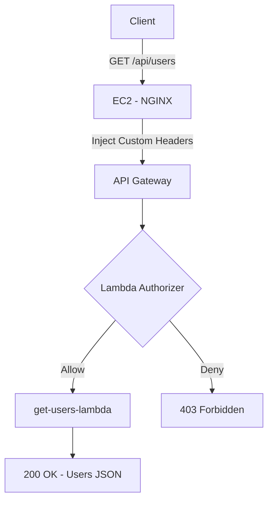

# AWS API Gateway Security Architecture

The following diagram illustrates the secure request flow through NGINX, API Gateway, and AWS Lambda.

```mermaid
flowchart TD
    A["Client"] -->|"GET /api/users"| B["EC2 - NGINX"]
    B -->|"Inject Custom Headers"| C["API Gateway"]
    C --> D{"Lambda Authorizer"}
    D -->|"Allow"| E["get-users-lambda"]
    D -->|"Deny"| F["403 Forbidden"]
    E --> G["200 OK - Users JSON"]
```
